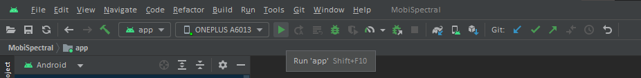
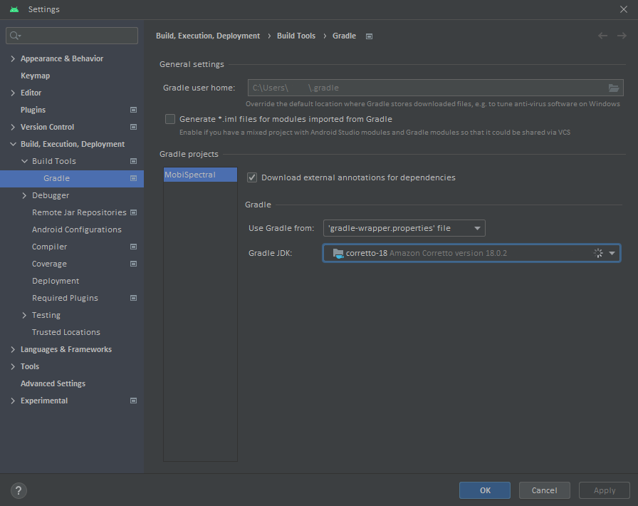

# MobiSpectral Application on Android
This application is written in Kotlin for Android phones. It works in two modes: offline and online. The offline mode processes pre-captured images, while the online mode captures and processes the images in real time. The online mode requires a phone that allows accessing the NIR camera. In both offline and online modes, the application offers two functions: 

- Simple Analysis: Distinguishes organic and non-organic fruits from RGB and NIR images.  The app asks the user to select a region of the image to be used in the analysis: by tapping anywhere in the image, a bounding box will appear. The app will then process the data in the bounding box and will display Organic or Non-Organic.

- Detailed Spectral Analysis: Allows the user to conduct an in-depth analysis of the hyperspectral bands reconstructed from the input RGB+NIR images. When a user taps on an area in the image, the app will compute and display the spectral signature for the pixels in that area. 

## Requirements
- Offline mode: Any Android smartphone should work. 
- Online mode: Android phones that allow access to the  NIR camera, such as Google Pixel 4 XL and OnePlus 8 Pro.

## Install the App
The apk for the application can be downloaded from here: [MobiSpectral Apk](https://drive.google.com/file/d/18bQZj7JiFfU4paXye6SbOPJlbtXJHpEB/view?usp=sharing "MobiSpectral Android Application"). 

Steps for installing the application on your phone are as follows:

- Press the apk file to install the application.
- If the application could not be downloaded, disable Play Protect (a service from Google that prevents users from installing applications that are not from Play Store) on your phone for the time being. To do that, follow the steps below:
	- Open `Google Play Store`.
	- Click your Profile Picture (top right).
	- Open `Play Protect` option and press the Settings Cog (top right).
	- Disable the option `Scan apps with Play Protect`
- After disabling "Play Protect" press apk file and, a pop-up will appear, asking you to allow downloading apps from other sources.  
- When the application is installed, the app will ask for permission to access the camera and storage on your phone.
	- Camera Permission: required to capture images using the cameras.
	- Storage Permission: required to save and load images from the disk.
- The application will be installed, and you will reach the Main page of the application.

You can also [Build the application from source code](#build_the_application_from_source_code).


## Download Datasets for Offline Mode

For the offline mode, you can acquire one or more of the following Mobile Image Datasets to test our application:

- [Tomatoes (1.66 GB)](https://drive.google.com/file/d/1WbQpNG6GFtvjijb9g27n8QE_yDip8tGH/view?usp=drive_link "Tomatoes Test Dataset")
- [Blueberries 1.83 GB](https://drive.google.com/file/d/1jYHs0Q9rnsx58IaHoR0wSvS4Ep0l7IUO/view?usp=drive_link "Blueberries Test Dataset")
- [Strawberries 1.92 GB](https://drive.google.com/file/d/1taaiWVIwjy8PtiuxdxNvr2CTWkuhv_Q4/view?usp=drive_link "Strawberries Test Dataset")
- [Kiwis (2.52 GB)](https://drive.google.com/file/d/16B9Jnwgo9Xev4db3ROqvL8_64vAr3l-H/view?usp=drive_link "Kiwis Test Dataset")
- [Apples (11.39 GB)](https://drive.google.com/file/d/1WtogFi1ahG5ejzpcp0GcUs64MEuQDJjT/view?usp=drive_link "Apples Test Dataset")


## Test the Application in Offline Mode
In the offline mode, you process the images (RGB and NIR) pre-captured when you downloaded the datasets. Each dataset follows the following directory structure:
```
dataset_[fruit]
│
└── classification
│
└── mobile_data
│	│
|	└── nonorganic
|	│	[num]_NIR.jpg
|	|	[num]_RGB.jpg
|	|	...
|	|
|	└── organic
|	│	[num]_NIR.jpg
|	|	[num]_RGB.jpg
|	|	...
|
└── reconstruction
	...
```

Steps to run the application in offline mode:
1. Unzip the dataset that you downloaded before
2. Run the application
3. Check the offline mode to be used
	- `mobile_data` directory is where you'll find the folders where you can select images from either organic or nonorganic pool of images and you can test which fruits output which classification label.
4. Select two images (RGB and NIR) from the Pop-up by tapping
5. (Optional) Choose the area where the fruit is present in the image
6. Reconstruct the hypercube
7. The application shows the predicted classification label for the fruit

<!--  -->

## Test the Application in Online Mode
NIR cameras is the backbone of this system because it can capture visual information that the simple RGB camera cannot, and it helps the Reconstruction model in accurately predicting what information should be present in a particular band (image whose reflectance map achieved by shining a particular wavelength of light).

Most smartphones with an NIR camera have it on the front because its primary function is facial recognition, which means capturing images of fruits (on a table) in our case is quite difficult for the user. To assist the user in capturing images we added a count down timer with beeping sound. This aural feedback assists the user to correctly capture the images because if the images are very misaligned the results would suffer quite a lot.

Steps to run the application in online mode:
1. Run the application
2. Without checking the offline mode tap on run
3. When you press the capture button, it will beep thrice and capture the images
4. (Optional) Choose the area where the fruit is present in the image
6. Reconstruct the hypercube
7. The application shows the predicted classification label for the fruit

<!--  -->

<!-- ## Pipeline

1. Image Capturing: RGB followed by NIR.
3. Image Alignment: Aligning the two images captured.
4. Deep White Balancing: Android ported models from [[Deep White Balance](https://github.com/mahmoudnafifi/Deep_White_Balance), [Models](https://github.com/mahmoudnafifi/Deep_White_Balance/tree/master/PyTorch/models)].
5. Patch Selection: Selecting the part of image we want to use.
6. Hyperspectral Reconstruction: RGB+NIR -> Hypercube.
7. Classification: based on 1-D signatures selection. -->


## Build the application from source code
Download Android Studio on your workstation (see Installation Instructions on [Android Developer website](https://developer.android.com/studio)). After Installing Android Studio, clone the repository onto your workstation. Gradle is a tool which comes pre-installed with Android Studio and is responsible for Dependency management. In the repository, there are also gradle files present, which tell gradle which dependencies to install on your workstation. The major dependencies which we tested and deployed (So please make sure that these dependencies are consistent) our final application are as follows:

- Android Studio Flamingo | 2022.2.1 Patch 2 (tested on previous versions as well)
- Kotlin 1.8.20 (Also tested on 1.7.21)
- Gradle: 8.0.2 (Also tested on 7.5.0, 7.4.0, 4.2.2)
- JDK Version: 18.0.2 [Amazon Corretto Version] (Also tested on 17, 16)
- SDK versions 33 (target), 23 (minimum)
- AndroidX
- Dependencies
	- PyTorch: 1.8.0 (versions above it contain some bugs and uses Lite Interpreter which did not convert models to PyTorch mobile version)
	- OpenCV: 3.4.3

When Android Studio is set up on your workstation, connect your Android Smartphone. Now enable USB debugging on your phone (first enable Developer options, and then go in there to enable USB debugging). Your device name and model should now appear in the box next to `Run 'app'` button [See Image below]. If it does not appear, allow `File Transfer` on your smartphone and tapping on the USB connection/preferences notification. This [official guide](https://developer.android.com/studio/run/device "Guide to connect your phone to your PC") by Android Developers can be followed for this.

When the project is loaded onto your Android Studio, build the project using `Build` button from the top bar and press `Make Project` [`CTRL + F9`]. Building the project firstly run gradle dependency installer and installs all packages required by the project and then builds the project. After building the project run the project by pressing the `Run 'app'` button as can be seen in the following picture [`SHIFT + F10`]. Simply pressing the Run app button does all previous steps in one go (Installing dependencies, Building Project, Running app on your phone).



One common issue that can occur while building projects on recently installed Android Studio copy is missmatch of JDK source/target version. You can match this dependency by pressing the "File" button and opening up Settings [`CTRL + ALT + S`] then on the left pane expand `Build, Execution, Deployment` option and under there click on `Gradle` under `Build Tools`. Now on this page press Gradle JDK and set it to 18.0.2 [Amazon Corretto Version], if its not installed, install it using the button below [See image below]. The structure of Android Studio may change and these instructions are true for Android Studio Flamingo | 2022.2.1 Patch 2 version.



## References
- Picture capturing code using Camera API 2 and was forked from [Android/Camera2Basic](https://github.com/android/camera-samples/tree/main/Camera2Basic) and built upon from there.
- Models from [Deep White Balancing](https://github.com/mahmoudnafifi/Deep_White_Balance) were ported to PyTorch Android.
